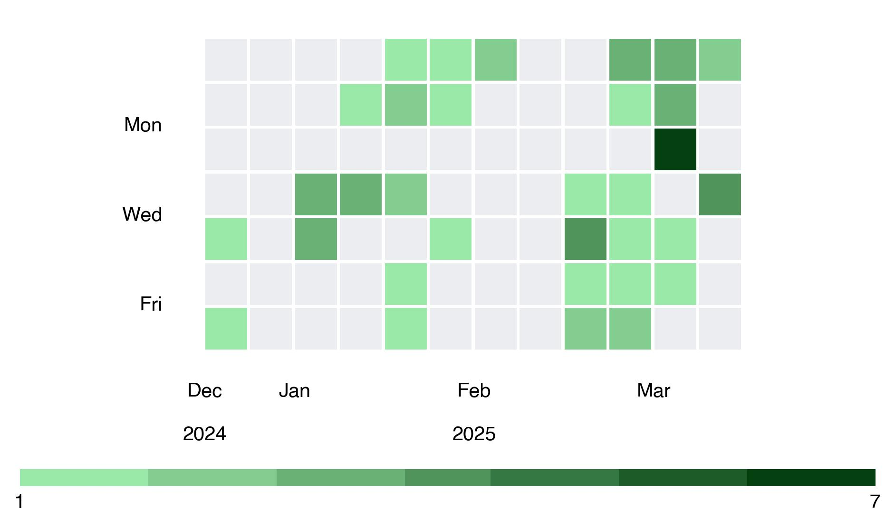

# GitHub-ContributionsGraph-Generator

A Python tool that generates GitHub-style contribution graphs from CSV data. This tool creates visualizations similar to the contribution activity graph shown on GitHub profiles.

## Features

- Creates a GitHub-style contribution heatmap from date and frequency data
- Dynamically adjusts colors based on contribution frequency
- Shows day of week and month labels
- Displays years for multi-year data
- Automatically handles date ranges and week alignment
- Generates high-quality JPG output

## Requirements

- Python 3.6+
- Required packages:
  - matplotlib
  - numpy

Install dependencies with:
```
pip install matplotlib numpy
```

## Usage

1. Create an `input.csv` file with your contribution data in the format:
   ```
   YYYY-MM-DD,frequency
   ```
   
   Example:
   ```
   2024-01-15,3
   2024-01-16,5
   2024-01-20,1
   2024-02-05,7
   ```

2. Run the script:
   ```
   python generator.py
   ```

3. The script will generate a `contribution_graph.jpg` file in the same directory.

## Customization

You can modify the script to:
- Change output format or resolution
- Adjust color schemes
- Modify the layout and appearance

## Example Output


The generated graph will show your contribution activity with varying shades of green based on the frequency of contributions, similar to GitHub's own visualization.

## License

MIT License

## Acknowledgments

Inspired by GitHub's contribution graph visualization.
